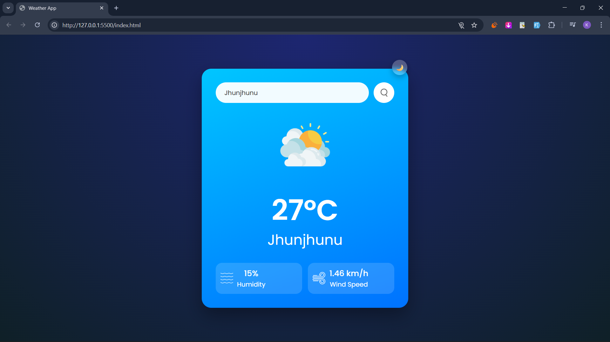
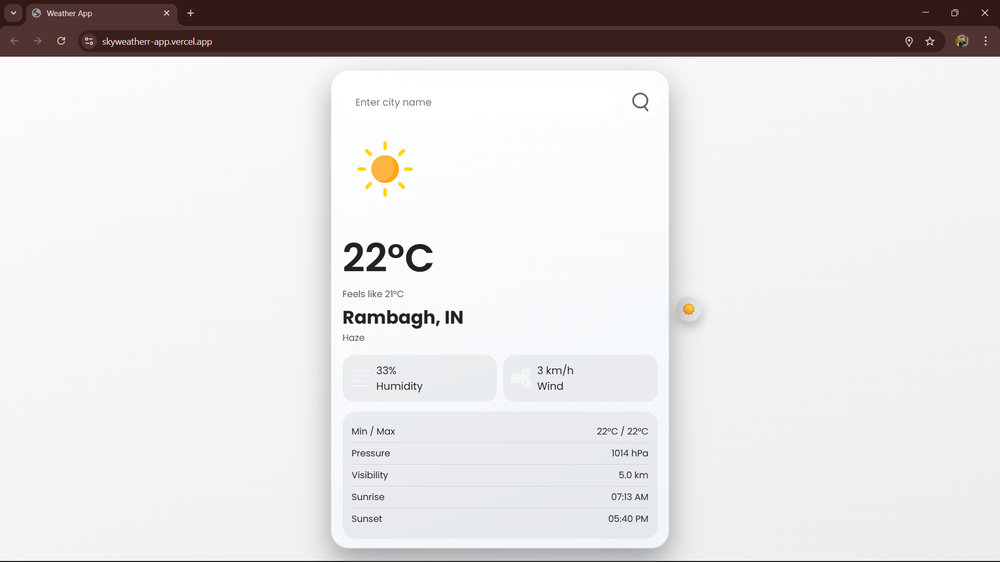

# 🌦 Weather App

<p align="center">
  <b>
    A modern, responsive weather application built with pure HTML, CSS, and JavaScript —  
    lightweight, fast, and perfect for portfolios & real-world demos.
  </b>
</p>

<p align="center">
  
  
  
  
</p>

---

## 🚀 What is this Project?

This is a **clean and user-friendly Weather App** that fetches **real-time weather data** using the **OpenWeather API**.

The app focuses on:

* Simple UI
* Smooth UX
* Mobile-first responsiveness
* Beginner-friendly but professional-level code

Perfect for:

* 💼 Portfolio projects
* 🎓 Learning JavaScript & APIs
* 🌐 Hosting on Netlify / GitHub Pages

---

## 🔥 Live Demo

🌍 **Live Website:**
[https://weather-app.netlify.app](https://weather-app.netlify.app)


---

## ✨ Features

* 🔍 Search weather by city name
* 📍 Get current location weather (Geolocation API)
* 🌗 Dark & Light mode toggle
* 💾 Theme preference saved using `localStorage`
* 🎞 Animated weather icons
* 📱 Fully responsive (mobile, tablet & desktop)
* ⚡ Fast & lightweight — no frameworks

---

## 🛠 Tech Stack

* **HTML5** — semantic & accessible markup
* **CSS3**

  * Flexbox
  * CSS Variables
  * Media Queries
* **JavaScript (ES6+)**

  * Fetch API
  * Async / Await
  * DOM Manipulation
* **OpenWeather API** — real-time weather data
* **Google Fonts** — Poppins

---

## 📸 Screenshots

<p align="center">
  
  
</p>

---

## 📂 Project Structure

```
weather-app/
├── index.html
├── style.css
├── images/
│   ├── clear.png
│   ├── clouds.png
│   ├── rain.png
│   ├── drizzle.png
│   ├── mist.png
│   ├── humidity.png
│   └── wind.png
├── screenshots/
│   ├── dark-mode.png
│   ├── light-mode.png
└── README.md
```

---

## ⚙️ Installation & Local Setup

### 1️⃣ Clone the Repository

```bash
git clone https://github.com/bitkaran/weather-app.git
cd weather-app
```

### 2️⃣ Run Locally

* Open `index.html` directly **OR**
* Use **VS Code Live Server** for best experience

> ⚠️ Geolocation works best on `localhost` or `https`.

---

## 🔑 API Key Information

This project uses the **OpenWeather API**.

```js
const apiKey = "092ae207c7e0ce836703f50719d6440a";
```

### ⚠️ Note

* API key is visible in JavaScript (okay for learning)
* Not recommended for production apps

---

## 🚀 Deployment (Netlify)

1. Push project to GitHub
2. Go to **Netlify → New site from Git**
3. Select your repository
4. Publish directory: `/`
5. Deploy 🎉

---

## 🤝 Contributing

Contributions are welcome!

1. Fork the repo
2. Create a new branch
3. Commit your changes
4. Open a Pull Request

---

## 📜 License

This project is open-source and free to use for:

* Learning
* Academic work
* Personal portfolios

---

## 👨‍💻 Author

**Karan Singh**

* 💻 Frontend Developer
* 📧 Email: [karan.devmail@gmail.com](mailto:karan.devmail@gmail.com)
* 🔗 LinkedIn: [https://www.linkedin.com/in/bitkaran/](https://www.linkedin.com/in/bitkaran/)
* 🐙 GitHub: [https://github.com/bitkaran](https://github.com/bitkaran)

---

## 💬 Final Note

> *“Small projects done well matter more than big projects done halfway.”*

If you liked this project, ⭐ the repository and share it!
